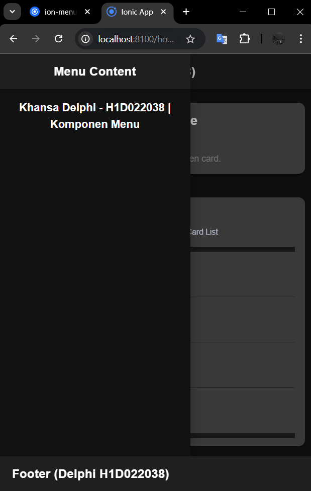

# LabMobile6_Khansa-Delphi_H1D022038

## Screenshot

Bagaimana cara untuk menambahkan Komponen di halaman Ionic? 
Untuk menambahkan komponen, kita bisa pergi ke dokumentasi ionic (https://ionicframework.com/docs/) dimana di dokumentasi tersebut banyak komponen komponen yang bisa digunakan. Seperti contohnya di projek yang saya buat ini, saya menambahkan komponen card, card list, dan menu. Ketiga komponen tersebut diambil dari dokumentasi ionic. Tampilan bisa disesuaikan dengan gaya masing masing.